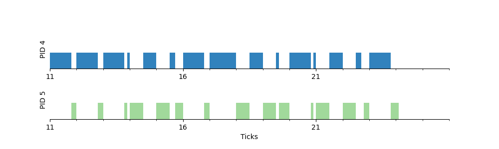
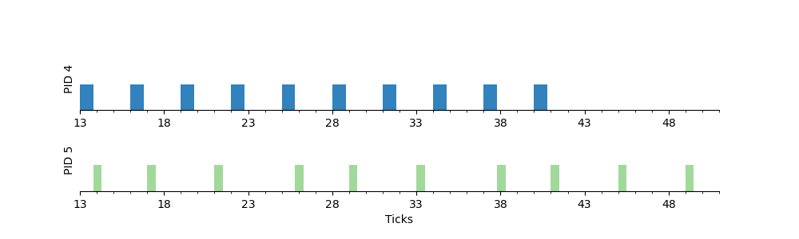
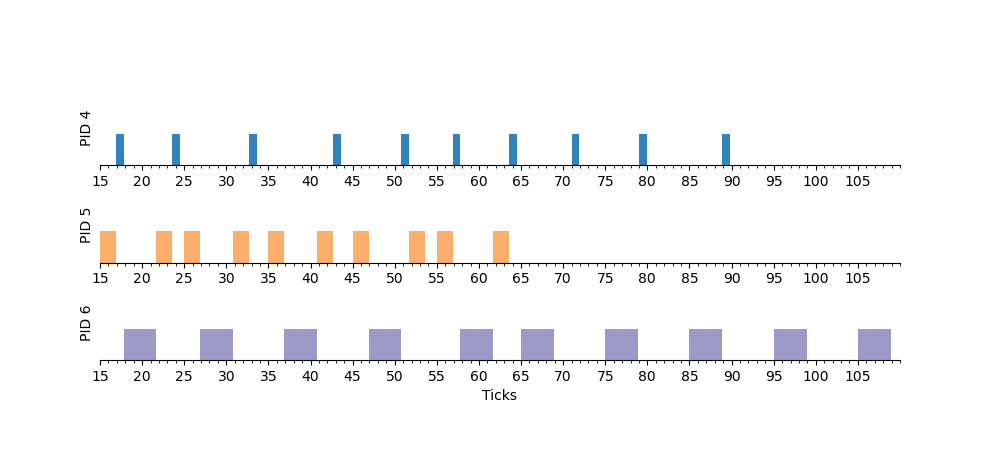

# 4190.307 Operating Systems (Spring 2024)
# Project #3: The EDF (Earliest Deadline First) Scheduler 
### Due: 11:59 PM, April 28 (Sunday)

## Introduction

Currently, the CPU scheduler of `xv6` uses a simple round-robin policy. The goal of this project is to understand the scheduling subsystem of `xv6` by implementing the EDF (Earliest Deadline First) scheduler used in real-time systems.

## Background

### Real-time Systems

Real-time systems are computing systems that can respond to inputs or events within predictable and specific time constraints. Common examples of real-time systems include air traffic control systems, nuclear power plant control systems, and autonomous driving systems. 
Real-time schedulers in real-time operating systems (RTOS) are designed to handle workloads where processes must be completed within strict timing constraints. The primary objective of real-time scheduling is to ensure that all critical processes meet their deadlines, which is crucial for maintaining the reliability and safety of time-sensitive applications. 

### EDF Scheduler

The EDF (Earliest Deadline First) scheduler is a dynamic priority scheduling algorithm used in real-time systems. In EDF scheduling, processes are prioritized based on their deadlines -- the process with the closest deadline is given the highest priority and is scheduled to run next. We focus on scheduling periodic processes, where each process $P_i$ has two scheduling parameters ($C_i$, $T_i$). $C_i$ is the maximum runtime that the process requires to complete its execution under worst-case conditions and $T_i$ denotes the period of the process at which the process repeats. In this periodic process model, deadlines are equal to periods; once a process is scheduled, the execution of the process should be completed before the start of the next period. For an ideal processor (one that can switch processes instantaneously with no overhead), it has been proven that a set of processes $P$ = ${P_1, P_2, ..., P_n}$ are schedulable to meet all deadlines under EDF if and only if the following condition is met: $$U = \sum_{i=1}^n \frac{C_i}{T_i} \le 1$$

The following timing diagram shows the scheduling of three processes, $P_1 = (1, 8), P_2 = (2, 5), P3 = (4, 10)$ under the EDF scheduling. For more information on the EDF scheduling, please refer to [here](https://en.wikipedia.org/wiki/Earliest_deadline_first_scheduling).


## Problem specification

### 1. Implement the `sched_setattr()` system call (10 points)

First, implement the `sched_setattr()` system call. The system call number of `sched_setattr()` is already assigned to 30 in the `./kernel/syscall.h` file. 

__SYNOPSYS__
```
    int sched_setattr(int pid, int runtime, int period);
```

__DESCRIPTION__

The `sched_setattr()` system call sets the EDF scheduling parameters for the process whose PID is specified in `pid`. If `pid` equals zero, the scheduling parameters of the calling process will be set. 
The `runtime` and `period` arguments specify the worst-case execution time and the period in the EDF scheduling. These values are expressed in timer ticks and should be positive integers where `runtime` < `period`.  
If a process has positive `runtime` and `period` values, we call it a real-time process. For normal processes, these values are initialized to zero. 

__RETURN VALUE__

* `sched_setattr()` returns 0 on success. On error, -1 is returned.

### 2. Implement the `sched_yield()` system call (20 points)

Next, you need to implement the `sched_yield()` system call for the EDF scheduler. The system call number of `sched_yield()` is already assigned to 31 in the `./kernel/syscall.h` file. 

__SYNOPSYS__
```
    void sched_yield();
```

__DESCRIPTION__

For normal processes, the `sched_yield()` system call causes the calling process to relinquish the CPU. For real-time processes, however, calling the `sched_yield()` system call means that the process has completed its execution in the current period. The implementation of the `sched_yield()` system call for normal processes is provided in the skeleton code, where it simply calls the `yield()` kernel function to schedule the next runnable process. You need to modify the `sched_yield()` system call implementation for real-time processes, so that the current real-time process gives up the CPU and waits until the start of its next period. 

__RETURN VALUE__

* `sched_yield()` does not return any value

### 3. Implement the EDF scheduler (70 points)

Add the EDF scheduler on top of the default round-robin scheduler in `xv6`. At any moment, the system can have both normal processes and real-time processes. Real-time processes always have a higher priority than normal processes. Hence, normal processes are scheduled in a round-robin fashion only when there are no runnable real-time processes. When there are multiple runnable real-time processes, the one with the nearest deadline is executed next. If more than one real-time process has the same deadline, apply these tie-breaking rules:
1. Select the current process if it is among them.
2. If not, assign the CPU to the process with the smallest `pid`.

`xv6` maintains a `ticks` variable in `./kernel/trap.c`, which is incremented by one on every timer interrupt. Assume two real-time processes are created in ticks 5: $P_1 = (1, 4)$, and $P_2 = (2, 9)$. 
Their deadlines are set to ticks 9 and 14, respectively. At ticks 5, the scheduler compares the time intervals to these deadlines -- 4 ticks for $P_1$ and 9 ticks for $P_2$. Since $P_1$'s deadline is closer, it is scheduled first. Although $P_1$'s worst-case runtime is 1 tick, it typically completes sooner. At some point during ticks 5, $P_1$ calls `sched_yield()` to end its execution. The scheduler then puts $P_1$ to sleep until its next period at ticks 9, and schedules $P_2$. 

Real-time processes can be preempted on a timer interrupt. Assume a new real-time process $P_3 = (2, 5)$ is forked by $P_2$ while $P_2$ is running on the CPU at ticks 5. At the next timer interrupt (ticks 6), both $P_2$ and $P_3$ are in the run queue, with deadlines at ticks 14 and 10, respectively. Since $P_3$'s deadline is sooner, the scheduler will execute $P_3$ at ticks 6. Note that even though $P_3$ has a higher priority due to its closer deadline, it does not immediately preempt the currently running process upon creation.

## Restrictions

* You can assume that the actual execution time of a real-time process is always less than its worst-case `runtime` specified by the `sched_setattr()` system call.
* It can be assumed that real-time processes perform no I/O operations.
* The implementation of the EDF scheduler should not affect the functionality of the default round-robin scheduler. If there are no real-time processes, the scheduling behavior should remain unchanged from the original `xv6`. To ensure this, test your implementation by running the quick `usertests` provided by `xv6` using the following command: `$ usertests -q`
* For this project assignment, you can assume a uniprocessor RISC-V system (`CPUS` = 1).
* Please use the `qemu` version 8.2.0 or later. To determine the `qemu` version, use the command: `$ qemu-system-riscv64 --version`
* We will run `qemu-system-riscv64` with the `-icount shift=0` option, which enables aligning the host and virtual clocks. This setting is already included in the `Makefile` for the `pa3` branch.
* You only need to change the files in the `./kernel` directory. Any other changes will be ignored during grading.

## Skeleton code

The skeleton code for this project assignment (PA3) is available as a branch named `pa3`. Therefore, you should work on the `pa3` branch as follows:

```
$ git clone https://github.com/snu-csl/xv6-riscv-snu
$ git checkout pa3
```

After downloading, you must first set your `STUDENTID` in the `Makefile` again.

The `pa3` branch includes two user-level programs called `task1` and `task2`, whose source code is available in `./user/task1.c` and `./user/task2.c`, respectively. The `task1` program forks two real-time processes $P_1 = (1, 3)$, and $P_2 = (1, 4)$. Each process spends some CPU time and then calls `sched_yield()` for 10 times. If you run `task1` under the current round-robin scheduler, you will get the following output. The first column shows the current time as measured by the `time()` system call, which we have implemented in our previous project assignment. The time is displayed in units of 0.1 tick; therefore, a value of 110 corresponds to 11.0 ticks. The second column represents the PID of the process. Note that the initial tick number may vary depending on when you execute the program.

```
xv6 kernel is booting

init: starting sh
$ task1
110 4 starts
118 4 ends
118 5 starts
120 4 starts
128 4 ends
130 4 starts
138 4 ends
139 5 ends
139 4 starts
140 5 starts
145 5 ends
150 5 starts
155 5 ends
157 4 ends
157 5 starts
160 4 starts
168 4 ends
170 4 starts
178 4 ends
178 5 ends
178 4 starts
180 5 starts
185 5 ends
190 5 starts
195 5 ends
196 4 ends
196 5 starts
200 4 starts
208 4 ends
209 5 ends
209 4 starts
210 5 starts
215 5 ends
220 5 starts
225 5 ends
227 4 ends
228 5 starts
230 4 starts
238 4 ends
241 5 ends
$ QEMU: Terminated
```

We provide you with a Python script called `graph.py` in the `./xv6-riscv-snu` directory. You can use this Python script to convert the above `xv6` output into a graph image. This graph will visually represent the order and timing of process executions, allowing you to see how different processes are scheduled and executed over time. Note that the `graph.py` script requires the Python matplotlib package. Please install it using the following command:
```
$ sudo apt install python3-matplotlib
```

In order to generate a graph, you should run `xv6` using the `make qemu-log` command that saves all the output into the file named `xv6.log`. And then run the `make png` command to generate the `graph.png` file using the Python script `graph.py` as shown below.

```
$ make qemu-log
qemu-system-riscv64 -machine virt -bios none -kernel kernel/kernel -m 128M -smp 1 -nographic -icount shift=0 -global virtio-mmio.force-legacy=false -drive file=fs.img,if=none,format=raw,id=x0 -device virtio-blk-device,drive=x0,bus=virtio-mmio-bus.0 | tee xv6.log

xv6 kernel is booting

init: starting sh
$ task1                     <--- Run the task1 program 
110 4 starts
118 4 ends
...
            
$ QEMU: Terminated         <--- Quit qemu using ^a-x
*** The output of xv6 is logged in the 'xv6.log' file.

$ make png                 <--- Generate the graph. (this should be done on Ubuntu, not on xv6)
./graph.py xv6.log graph.png
```

If everything goes fine, you will get the following graph. 




If the same `task1` program is executed under the EDF scheduler, you should get the following graph. You can see that $P_1$ is executed once  every 3 ticks, and $P_2$ once every 4 ticks.




The `task2` program forks three real-time processes, $P_1 = (1, 8)$, $P_2 = (2, 5)$, and $P3 = (4, 10)$, as in the example [here](https://en.wikipedia.org/wiki/Earliest_deadline_first_scheduling#Example). The scheduling sequence under the EDF scheduler will look like this.




## Tips

* Read Chap. 7 of the [xv6 book](http://csl.snu.ac.kr/courses/4190.307/2024-1/book-riscv-rev3.pdf) to understand the scheduling subsystem of `xv6`. 

* For your reference, the following roughly shows the amount of changes you need to make for this project assignment. Each `+` symbol indicates 1~5 lines of code that should be added, deleted, or altered.
```
 kernel/proc.c    |  +++++++++++++++++++++++++++
 kernel/proc.h    |  +
 kernel/sysproc.c |  +++
 kernel/trap.c    |  +
```
  
## Hand in instructions

* First, make sure you are on the `pa3` branch in your `xv6-riscv-snu` directory. And then perform the `make submit` command to generate a compressed tar file named `xv6-{PANUM}-{STUDENTID}.tar.gz` in the `../xv6-riscv-snu` directory. Upload this file to the submission server. You don't need to upload any documents for this project assignment.
  
* The total number of submissions for this project assignment will be limited to 30. Only the version marked as `FINAL` will be considered for the project score. Please remember to designate the version you wish to submit using the `FINAL` button. 
  
* Note that the submission server is only accessible inside the SNU campus network. If you want off-campus access (from home, cafe, etc.), you can add your IP address by submitting a Google Form whose URL is available in the eTL. Now adding your new IP address is automated by a script that periodically checks the Google Form every 10 minutes.
     + If you cannot reach the server 10 minutes after submitting the Google Form, send the request again, as you might have sent the wrong IP address.
     + If you still cannot access the server after a while, that is likely due to an error in the automated process. The TAs will check if the script is properly running, but that is a ___manual___ process, so please do not expect it to be completed immediately.


## Logistics

* You will work on this project alone.
* Only the upload submitted before the deadline will receive the full credit. 25% of the credit will be deducted for every single day delayed.
* __You can use up to _3 slip days_ during this semester__. If your submission is delayed by one day and you decide to use one slip day, there will be no penalty. In this case, you should explicitly declare the number of slip days you want to use in the QnA board of the submission server right after each submission. Once slip days have been used, they cannot be canceled later, so saving them for later projects is highly recommended!
* Any attempt to copy others' work will result in a heavy penalty (for both the copier and the originator). Don't take a risk.

Have fun!

[Jin-Soo Kim](mailto:jinsoo.kim_AT_snu.ac.kr)  
[Systems Software and Architecture Laboratory](http://csl.snu.ac.kr)  
[Dept. of Computer Science and Engineering](http://cse.snu.ac.kr)  
[Seoul National University](http://www.snu.ac.kr)
